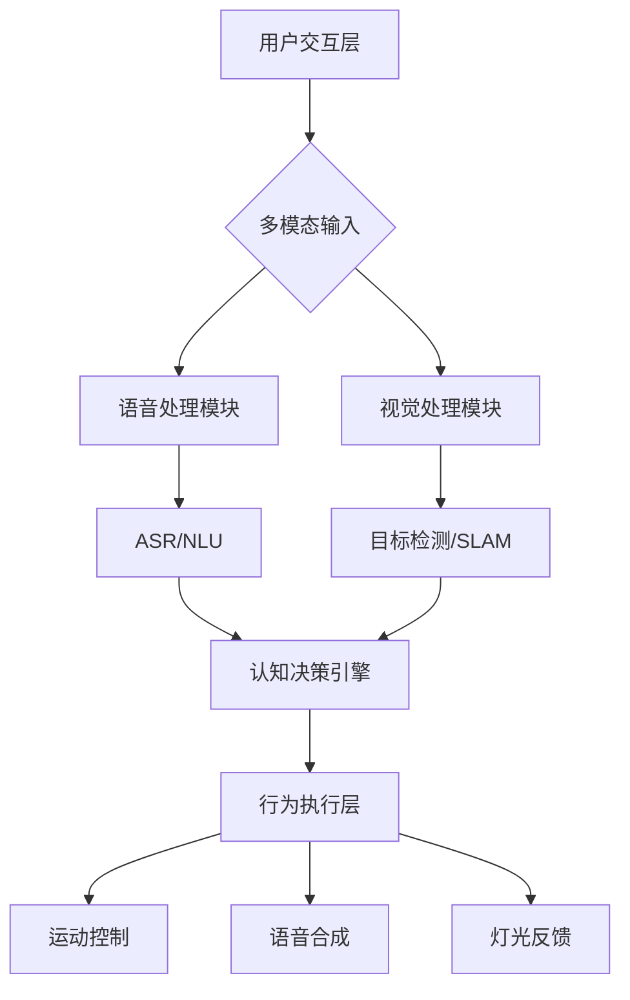

# NAO机器人具身智能项目需求分析

## 一、项目背景

随着人工智能技术的飞速发展，具身智能逐渐成为机器人研究领域的热点。具身智能强调将智能算法与物理身体相结合，使机器人能够更好地理解和适应真实世界。NAO机器人作为一款人形机器人平台，具备视觉、听觉、触觉等多种感知能力，以及丰富的运动控制功能，为研究具身智能提供了理想的载体。 

基于NAO人形机器人平台，我们结合具身智能（Embodied AI）理念，构建多模态交互的智能系统。项目依托现有开发框架（含ASR、TTS、YOLO目标检测、运动控制等模块），重点面向教育辅助与家庭服务场景，实现自然交互与任务执行能力。

## 二、场景需求分析

| 场景类型 | 需求描述                                           | 关键技术要求                           |
| -------- | -------------------------------------------------- | -------------------------------------- |
| 教育演示 | 根据语音指令完成舞蹈动作教学<br>实时解答学习者疑问 | 动作时序控制、知识库集成、语音打断处理 |
| 物品递送 | 识别用户描述的物品并抓取<br>自主导航至目标位置     | YOLO目标检测、路径规划、抓取力控制     |
| 交互陪伴 | 多轮自然对话<br>情感化表情反馈                     | 大语言模型集成、情感识别、LED表情控制  |
| 环境监测 | 自主巡检并报告异常<br>执行简单应急操作             | SLAM建图、异常检测、动作序列编排       |

## 三、功能性需求

##### 1. 语音交互模块（ASR/LLM）

- **语音识别(ASR)**：实时音频流处理，支持中英文指令识别（FastASR模型）
- **语义理解(LLM)**：调用第三方模型服务API的语义理解与意图识别（NLU），对话生成能力
- **语音合成(TTS)**：流式语音合成（TTS）带韵律控制，支持动态断句输出（CustomTTS类）
- *性能指标*：识别准确率>90%，响应延迟<1.5s

##### 2. 视觉抓取模块（YOLO/Grasp）

- **物体检测**：多目标实时检测（YOLO）
- **空间定位**：立体视觉定位（双目摄像头）
- **运动控制**：路径规划算法
- **动态手势识别**
- **性能指标*：检测精度mAP>0.85，抓取成功率>80%

##### 3. 舞蹈表演模块

- **动作编排**：关节角度插值控制
- **音乐同步**：MP3播放与动作时序对齐
- *性能指标*：动作误差<2°，音乐同步误差<0.3s

##### 4. 音乐播放系统

- **曲目管理**：支持8首预置歌曲
- **播放控制**：跨进程音频管理
- *特殊需求*：播放中断恢复功能

##### 5. **运动控制系统**

- 舞蹈动作库（太极、现代舞等）
- 自适应抓取策略（力反馈调节）
- 避障行走（激光雷达融合）

##### 6. **认知决策系统**

- 任务状态机管理
- 异常处理策略（跌倒检测、抓取失败恢复）
- 多模态行为协调（语音+动作+灯光）

## 三、非功能性需求

| 需求维度 | 具体要求                                 |
| -------- | ---------------------------------------- |
| 实时性   | 语音识别延迟<800ms，视觉处理帧率≥15FPS   |
| 可靠性   | 7×24小时连续运行，单点故障不影响核心功能 |
| 可扩展性 | 模块化设计，支持新增动作/歌曲/物体类型   |
| 安全性   | 急停机制，关节运动边界检测               |
| 能耗要求 | 连续工作续航≥2小时                       |

## 四、系统架构设计



**分层架构**：

```
┌──────────────────────────────┐
│      应用层                  │
│  - 指令分发(execute_command) │
│  - 状态管理(state_machine)   │
├──────────────────────────────┤
│      服务层                  │
│  - 语音服务(ASR/LLM/TTS)     │
│  - 视觉服务(YOLO/SLAM)       │
│  - 运动控制(ALMotion)        │
├──────────────────────────────┤
│      硬件抽象层              │
│  - 传感器接口(Camera/Mic)    │
│  - 执行器接口(Motor/LED)     │
│  - NAO本体                  │
└──────────────────────────────┘
```

**数据流**：

```
麦克风 → 音频流 → ASR → 文本 → LLM 
                      ↓
摄像头 → 图像帧 → YOLO → 坐标 → 运动规划
                      ↓ 
执行结果 → TTS → 语音反馈
```

## 五、关键技术方案

1. **多模态融合**：

   - 指令映射机制
   - 对话状态机
   - 双缓冲语音处理

2. **视觉定位优化**：

   ```python
   # 混合定位策略
   def process_table():
       if 下摄像头检测失败:
           启用上摄像头广角搜索
           动态调整头部姿态
       else:
           采用像素梯度定位法
           应用运动学逆解算
   ```

3. **动作控制**：

   - 贝塞尔曲线插值（angleInterpolationBezier）
   - 姿态平衡补偿算法
   - 碰撞检测策略（压力传感器反馈）

## 六、关键技术指标

1. **实时性要求**
   - 语音延迟 < 300ms（端到端）
   - 视觉处理帧率 ≥ 15fps
   - 动作响应延迟 < 500ms
2. **可靠性要求**
   - 语音识别准确率 ≥ 90%
   - 物体抓取成功率 ≥ 85%
   - 系统连续运行时间 ≥ 8小时

3. **扩展性要求**
   - 模块化架构支持功能扩展
   - 支持第三方API接入（如知识图谱）
   - 配置驱动型状态机

## 

|      |      |      |      |
| ---- | ---- | ---- | ---- |
|      |      |      |      |
|      |      |      |      |
|      |      |      |      |
|      |      |      |      |

## 七、验证指标

1. **功能验证矩阵**：

| 测试项         | 方法                    | 通过标准          |
| -------------- | ----------------------- | ----------------- |
| 语音指令识别   | 200条样本测试集         | 准确率≥95%        |
| 物体抓取成功率 | 不同光照/位置各10次测试 | 综合成功率≥85%    |
| 舞蹈动作精度   | 运动捕捉系统对比分析    | 关节角度误差≤1.5° |

2. **压力测试方案**：
   - 持续8小时混合指令负载
   - 80%CPU占用率下响应延迟测试
   - 网络抖动环境下的服务稳定性

## 八、开发里程碑

| 阶段     | 时间 | 交付物                         | 风险评估                   |
| -------- | ---- | ------------------------------ | -------------------------- |
| 基础框架 | ？周 | 模块通信机制、配置管理系统     | 跨平台SDK兼容性问题        |
| 核心模块 | ？周 | 语音/视觉/运动控制模块联调     | YOLO模型嵌入式部署性能瓶颈 |
| 场景优化 | ？周 | 完整业务流程实现、压力测试报告 | 多线程资源竞争问题         |
| 部署上线 | ？周 | 安装包、用户手册、演示视频     | 现场环境差异导致定位偏差   |

## 九、开发约束

1. **硬件限制**

   - NAO V6标准配置（Atom Z530/1GB内存）
   - 最大关节力矩限制（防止硬件损坏）
   - 摄像头分辨率限制（640x480@30fps）
2. **软件限制**

   - 进程内存占用 < 800MB
   - 不支持GPU加速（需模型轻量化）
   - 实时系统优先级控制（防止线程阻塞）


## 十、风险分析

1. **技术风险**
   - 多模态时序同步问题
   - 低算力下的实时性保障
   - 复杂环境下的感知稳定性、目标检测失效
   - 长时运行内存泄漏
   - 跨平台兼容性问题
   - 多人语音指令干扰

2. **缓解方案**
   - 采用自适应帧率控制算法
   - 开发模型量化工具链（FP16量化）
   - 建立仿真测试环境（Webots集成）
   - 开发多模态融合检测（RGB-D+激光雷达）备用方案
   - 引入内存池管理机制，每6小时自动执行系统自检
   - 构建Docker容器化运行环境，隔离硬件驱动依赖
   - 集成声源定位+波束成形技术，实现定向拾音

---

> 本文档 90% 由 DeepSeek 和 Gemini 生成，本人对生成结果进行整合和梳理。